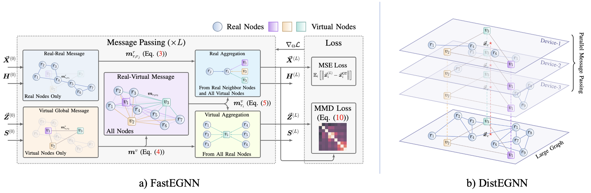

# Source code of "Fast and Distributed Equivariant Graph Neural Networks by Virtual Nodes Learning"

We introduce FastEGNN and DistEGNN, two enhanced models specifically designed to handle large sparse graphs efficiently and effectively by incorporating virtual nodes.




## Environment
```bash
  conda create --name distegnn python=3.9
  conda activate distegnn
  pip install -r requirements.txt
```

## Datasets

Refer to README in [dataset_generation](./dataset_generation) 

You can also directly download all dataset through this [link](https://pan.baidu.com/s/15v5t5Gdy2GbxcK0s-KLdaw). Code: mfvv

## Configure

We use a YAML file to configure training hyperparameters and logging configurations.
For example: [largefluid_distegnn](./config/largefluid_distegnn.yaml)

Before running experiments, you need to update the value of `data.data_dir` to your local dataset path. If you wish to use [wandb](https://wandb.ai), please configure the relevant parameters accordingly.

We provide two acceleration modes:

- `data.accelerate == cutoff_edge` enables edge-cutting acceleration, corresponding to the *FastEGNN* model. This mode supports single-device execution.
- `data.accelerate == distribute` enables distributed acceleration, corresponding to the *DistEGNN* model. This mode supports both single- and multi-device parallelism.

For DistEGNN, we support two graph partitioning methods:

- `data.split_mode == random` applies random partitioning, followed by graph construction using `data.inner_radius` as the cutoff radius.
- `data.split_mode == metis` uses the [METIS](https://github.com/KarypisLab/METIS) algorithm for partitioning. In this mode, the graph is first constructed using `data.outer_radius` as the cutoff, then METIS is applied for partitioning, and finally each device constructs subgraphs using `data.inner_radius`.

If you want to implement a custom partitioning strategy, you can define it in datasets/distribute_graphs.py.

## Run

### FastEGNN

```bash
python main.py --batch_size 200 --virtual_channels 3 --cutoff_rate 0.50 --wandb --model_name FastEGNN --config_path ./config/nbody_fastegnn.yaml
```

### DistEGNN

- Single device

```bash
python main.py --batch_size 1 --virtual_channels 5 --model_name FastEGNN --wandb --split_mode random --config_path ./config/largefluid_fastegnn.yaml
```

- Multiple devices

```bash
torchrun --nproc_per_node=8 --master_addr="localhost" --master_port=12344 main.py --model_name FastEGNN --wandb --split_mode random --batch_size 1 --virtual_channels 5 --config_path ./config/largefluid_fastegnn.yaml --checkpoint /path/to/checkpoint
```

*Parameters passed in the bash command will override those in the configuration file.*

## Equivariant Test

```bash
python equivariant.py
```

It will random generate a graph `G`, rotation matrix `R` and translation vector `t`, and check `FastEGNN(G @ R + t)` equals to `FastEGNN(G) @ R + t` or not.
   

## Citation

If you find our work helpful, please cite as:

```
@inproceedings{
    zhang2024improving,
    title={Improving Equivariant Graph Neural Networks on Large Geometric Graphs  via Virtual Nodes Learning},
    author={Yuelin Zhang and Jiacheng Cen and Jiaqi Han and Zhiqiang Zhang and JUN ZHOU and Wenbing Huang},
    booktitle={Forty-first International Conference on Machine Learning},
    year={2024},
    url={https://openreview.net/forum?id=wWdkNkUY8k}
}
```
